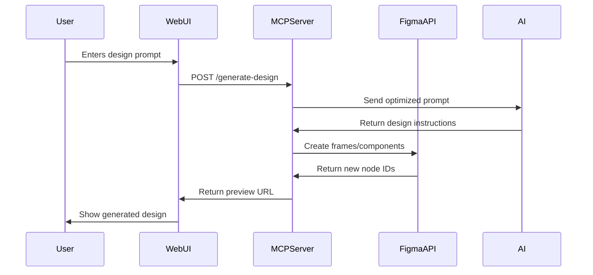

# Figma MCP Design Generator: Comprehensive Documentation

## 1. Project Overview

### 1.1 What is This Project?

A system that combines Anthropic's Model Context Protocol (MCP) with Figma's API to enable AI-assisted design generation. Users can:

- Generate Figma designs from text prompts
- Analyze existing designs through natural language queries
- Automate design system management
- Extract design tokens and components programmatically

### 1.2 Key Features

| Feature           | Description                                          | Tech Used   |
| ----------------- | ---------------------------------------------------- | ----------- |
| Text-to-Design    | Convert natural language prompts into Figma elements | MCP + GPT-4 |
| Design Analysis   | Get AI-powered suggestions for design improvements   | Claude 3    |
| Component Browser | Explore available design components through chat     | Figma API   |
| Style Sync        | Keep design systems consistent across files          | MCP Server  |
| Design Versioning | Track changes through AI-generated commit messages   | Git + MCP   |

## 2. Technical Architecture

### 2.1 System Diagram

```
[User Prompt] → [Web UI] → [MCP Client]
                  ↓
              [MCP Server] ↔ [Figma API]
                  ↓
[AI Service] ↔ [Design Generator] ↔ [Figma File]
```

### 2.2 Core Components

1. **MCP Server** (Node.js)

   - Handles communication between AI models and Figma
   - Manages API rate limiting and caching
   - Provides standardized interface for design operations

2. **Figma Service** (TypeScript)

   - Wrapper for Figma REST API
   - Implements caching strategy for frequent requests
   - Handles file operations and design generation

3. **Web Interface** (HTML/CSS/JS)

   - User-friendly prompt interface
   - Real-time design preview
   - Connection status monitoring

4. **AI Integration Layer**
   - Prompt optimization engine
   - Design instruction parser
   - Error correction mechanisms

## 3. Setup Guide

### 3.1 Prerequisites

```bash
# Required Tools
- Node.js 18.x+
- Figma Account (free tier sufficient)
- Modern Browser (Chrome/Firefox/Safari)

# Recommended Development Environment
- VS Code with Figma plugin
- Postman for API testing
- Figma Desktop App
```

### 3.2 Installation Steps

#### 3.2.1 Clone Repository

```bash
git clone https://github.com/yourusername/figma-mcp-design-generator.git
cd figma-mcp-design-generator
```

#### 3.2.2 Install Dependencies

```bash
npm install
npm install -g ts-node # For TypeScript execution
```

#### 3.2.3 Configure Environment

Create `.env` file:

```ini
FIGMA_API_KEY=your_figma_key_here
MCP_PORT=3333
AI_PROVIDER=anthropic # or 'openai'
AI_API_KEY=your_ai_key_here
CACHE_TTL=300 # 5 minutes
```

### 3.3 First-Time Setup Walkthrough

1. **Get Figma API Key**

   - Go to Figma → Account Settings → Personal Access Tokens
   - Create new token with "File Content Read" permissions

2. **Configure AI Provider**

   ```bash
   # For Anthropic
   export AI_API_KEY=your_anthropic_key

   # For OpenAI
   export AI_API_KEY=your_openai_key
   export AI_PROVIDER=openai
   ```

3. **Build the Project**

   ```bash
   npm run build
   ```

4. **Start Development Server**
   ```bash
   npm run dev
   ```

## 4. Core Workflows

### 4.1 Design Generation Flow



### 4.2 Key API Endpoints

| Endpoint                | Method | Description                        |
| ----------------------- | ------ | ---------------------------------- |
| `/mcp/design/generate`  | POST   | Generate design from text prompt   |
| `/mcp/design/update`    | PATCH  | Modify existing design elements    |
| `/mcp/components/list`  | GET    | List available components          |
| `/mcp/styles/sync`      | POST   | Sync styles across files           |
| `/mcp/analysis/suggest` | POST   | Get design improvement suggestions |

## 5. Implementation Details

### 5.1 Connecting to Figma

**Code Example: File Connection**

```typescript
// In src/server/figma-connector.ts
export async function connectToFigma(fileKey: string) {
  const client = new Figma.Client({
    personalAccessToken: process.env.FIGMA_API_KEY,
  });

  const file = await client.file(fileKey);

  return {
    name: file.name,
    components: file.components,
    styles: file.styles,
    lastModified: file.lastModified,
  };
}
```

### 5.2 Prompt Processing Pipeline

1. **Input Sanitization**

   ```typescript
   function sanitizePrompt(prompt: string) {
     return prompt.replace(/[^\w\s.,-]/gi, "").trim();
   }
   ```

2. **Context Enrichment**

   ```typescript
   function addDesignContext(prompt: string) {
     return `As a senior UI designer, create Figma components for: ${prompt}
             Consider modern design trends and accessibility standards.`;
   }
   ```

3. **AI Response Handling**

   ```typescript
   interface DesignInstruction {
     elements: UIElement[];
     layout: LayoutConfig;
     styles: StyleConfig;
   }

   function parseAIResponse(response: string): DesignInstruction {
     // Implementation for converting natural language to design specs
   }
   ```

## 6. AI Integration

### 6.1 Supported Models

| Provider  | Model       | Best For                       |
| --------- | ----------- | ------------------------------ |
| Anthropic | Claude 3    | Complex layout generation      |
| OpenAI    | GPT-4 Turbo | Rapid prototyping              |
| Local     | Llama 3     | Privacy-sensitive environments |

### 6.2 Sample AI Configuration

```yaml
# ai-config.yaml
providers:
  anthropic:
    model: claude-3-opus-20240229
    max_tokens: 4000
    temperature: 0.7

  openai:
    model: gpt-4-turbo-preview
    max_tokens: 4096
    temperature: 0.5

fallback_strategy: round_robin
```

## 7. Extending the Project

### 7.1 Adding New Features

**Example: Add Dark Mode Support**

1. Create new handler:

   ```typescript
   // src/handlers/theme-handlers.ts
   export const themeHandlers = [
     {
       method: "apply_theme",
       handler: async (req) => {
         // Implementation for theme application
       },
     },
   ];
   ```

2. Register handler in server:

   ```typescript
   themeHandlers.forEach((h) => server.setRequestHandler(h));
   ```

3. Update web interface:
   ```javascript
   // src/web/theme-switcher.js
   function toggleDarkMode() {
     document.body.classList.toggle("dark-theme");
   }
   ```

### 7.2 Customization Points

1. **Design Constraints**

   ```typescript
   // src/config/design-rules.ts
   export const DESIGN_RULES = {
     MAX_LAYERS: 200,
     COLOR_PALETTE: ["#FFFFFF", "#F0F0F0", "#333333"],
     GRID_COLUMNS: 12,
   };
   ```

2. **Prompt Templates**
   ```json
   // prompts/templates.json
   {
     "dashboard": "Create a analytics dashboard with...",
     "mobile_app": "Design a iOS-style mobile app...",
     "landing_page": "Modern landing page featuring..."
   }
   ```

## 8. Deployment Options

### 8.1 Cloud Deployment (AWS Example)

```bash
# Dockerfile
FROM node:18-alpine
WORKDIR /app
COPY package*.json ./
RUN npm ci --production
COPY . .
CMD ["npm", "start"]
```

```bash
# Deployment commands
aws ecr create-repository --repository-name figma-mcp
docker build -t figma-mcp .
docker tag figma-mcp:latest 123456789.dkr.ecr.region.amazonaws.com/figma-mcp:latest
docker push 123456789.dkr.ecr.region.amazonaws.com/figma-mcp:latest
```

### 8.2 Local Development Tips

1. **Debugging Setup**

   ```json
   // .vscode/launch.json
   {
     "version": "0.2.0",
     "configurations": [
       {
         "type": "node",
         "request": "launch",
         "name": "Debug Server",
         "program": "${workspaceFolder}/src/server/index.ts",
         "preLaunchTask": "npm: build"
       }
     ]
   }
   ```

2. **Performance Optimization**

   ```bash
   # Enable caching
   redis-server --port 6379

   # Cluster mode
   NODE_ENV=production node dist/server/index.js -i max
   ```

## 9. Contribution Guidelines

### 9.1 Branch Strategy

```
main
└── develop
    ├── feat/*
    ├── fix/*
    └── docs/*
```

### 9.2 Code Quality Standards

1. **Testing Requirements**

   ```bash
   # Unit tests
   npm test

   # E2E tests
   npm run test:e2e

   # Coverage report
   npm run coverage
   ```

2. **Linting Rules**
   ```json
   // .eslintrc
   {
     "extends": ["airbnb-typescript/base"],
     "rules": {
       "complexity": ["error", 5],
       "max-params": ["error", 3],
       "no-magic-numbers": "warn"
     }
   }
   ```

## 10. Resources & Support

### 10.1 Learning Materials

1. **Official Documentation**

   - [Figma API Docs](https://www.figma.com/developers/api)
   - [MCP Specification](https://modelcontextprotocol.org/docs)

2. **Community Resources**
   - `#figma-mcp` channel in Anthropic Discord
   - Figma Developer Office Hours (Every Thursday)

### 10.2 Troubleshooting Guide

| Issue                     | Solution                                     |
| ------------------------- | -------------------------------------------- |
| Missing Figma Permissions | Regenerate API token with correct scopes     |
| AI Model Timeouts         | Reduce response length or upgrade model tier |
| Connection Drops          | Check SSE transport configuration            |
| Design Rendering Issues   | Verify Figma file version compatibility      |

---

This documentation provides a comprehensive overview while maintaining technical depth. Developers can use this as both an onboarding guide and ongoing reference during project implementation.
